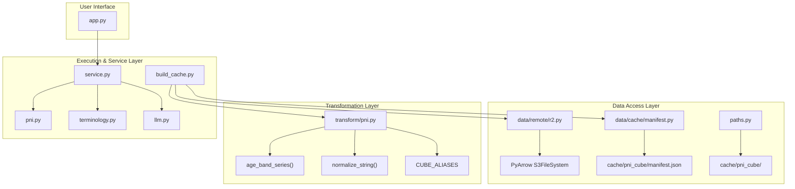

# Arquitetura do SUS Explorer

## Visão Geral

O **SUS Explorer** é uma plataforma de exploração analítica do SI-PNI (Sistema de Informação do Programa Nacional de Imunizações). O sistema opera sobre um cache colunar de alta performance particionado em Parquet (`cache/pni_cube/`), construído a partir dos microdados brutos do Ministério da Saúde no Cloudflare R2 / S3.

---

## Estrutura de Pacotes

```
sus_explorer/
├── __init__.py
├── paths.py                    # Constantes de caminhos centralizados do projeto
├── config.py                   # Configurações do sistema (dataclass Settings)
├── schemas.py                  # Schemas de dados da API / LLM (QueryPlan, etc.)
├── build_cache.py              # CLI/Script de construção do cubo de cache
├── pni.py                      # Mecanismo de consulta e execução remota/local
├── service.py                  # Fachada principal da aplicação
├── llm.py                      # Integração com o Google Gemini (LLM)
├── terminology.py              # Dicionários e padronização de imunobiológicos
├── data/
│   ├── cache/
│   │   └── manifest.py         # Leitura, escrita e validação do manifest.json
│   └── remote/
│       └── r2.py               # Conexão PyArrow S3FileSystem e caminhos no R2
├── domain/
│   └── provenance.py           # Modelos de proveniência e resultados de auditoria
└── transform/
    └── pni.py                  # Aliases canônicos, faixas etárias, normalização de strings
```

---

## Fluxo de Dados e Responsabilidades



---

## Diretrizes de Conservadorismo Arquitetural

1. **Invariância de Dados**: Nenhum arquivo do cache `cache/pni_cube` é reescrito durante refatorações.
2. **Backward Compatibility**: Imports históricos de `sus_explorer.build_cache` continuam funcionando através de re-exportações delegadas.
3. **Independência da Auditoria**: `sus_explorer/audit_ms_2023_10.py` e `recover_pni_2023_10.py` mantêm sua capacidade de auditoria determinística independente da produção.
